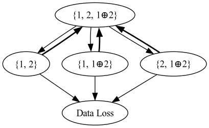
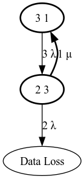
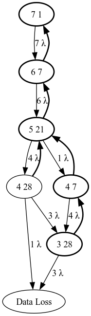
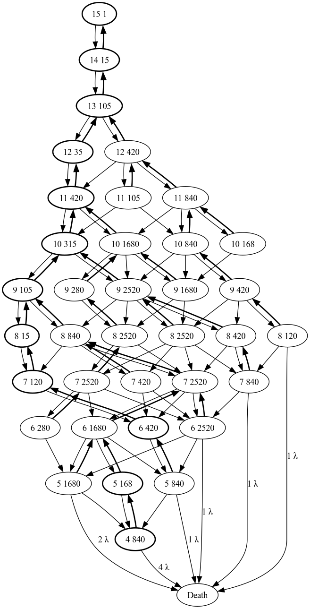

# SSPiRAL (Survivable Storage using Parity in Redundant Array Layouts) Simulator Collection

This is a collection of programs in various languages that simulate node failures for a data store using an erasure code I helped develop, called SSPiRAL. The primary output is the number of unique scenarios for each number of node failures, and the number of those scenarios that "survive", that is, do not lead to data loss.

Secondary outputs may include dot diagrams of Markov chains, which describe the behavior of the system at a more abstract level (i.e. ignoring node identities). Equally, one can generate Kolmogorov equations derived from these Markov chains, which can be solved to calculate the Mean Time To Data Loss (MTTDL), which is useful for comparing erasure codes, particularly non-optimal ones such as SSPiRAL.

The original purpose of this code was the exploration of behavior of the SSPiRAL erasure code. However, the challenge of writing efficient code to enumerate and categorize the failure scenarios has also been useful for my growth as a programmer, and has provided an opportunity to explore both optimization strategies at various levels and the affordances of various programming languages.

The collection of the most recent simulators resembles [The Computer Language Benchmark Game](https://benchmarksgame-team.pages.debian.net/benchmarksgame/index.html), as it pits similar algorithms against each other in C, D, Zig (Rust is in progress). These simulators currently do not produce the secondary outputs as these are of negligible computational complexity. The correct primary output (for several values of N) is sufficient to verify correctness of the implementation.

## A Brief Vocabulary

 * Node: a chunk of storage that fails as a unit. Depending on the system this could be as small as a data sector, or even a single bit, but I tend to think of a node as disk in a RAID-like storage array or a single storage server in a distributed system.
    * Data node: a node that represents information in the originally stored form. Some erasure codes do not have data nodes which complicates reads.
	* Parity node: a node where the information from multiple data nodes has been combined in a way that can be used to restore a failed data node, when recombined with other parity and/or data nodes. SSPiRAL creates parity nodes by XORing various combinations of data nodes.
 * **N**: the pre-established number of data nodes. This is the main parameter of a SSPiRAL encoding. (I'd consider it a implementation detail, but RAID arrays typically stripe data across data nodes in fixed size chunks, rather than filling the first node before moving on to the second. This is akin to having an array of parallel, independent encodings. Regardless, nodes can be arbitrarily large so **N** is not directly related to the size of the data stored.)
 * **M** = 2N - 1: the total number of unique nodes that may be used in a SSPiRAL encoding.
 * Node naming: rather than naming data nodes 1, 2, 3 I name them with powers of two 20 = 1, 21 = 2, 22 = 4... This means that data node names always have a single bit set, allowing parity nodes to be named as bitmap of the data nodes they combine, which is equivalent to the XOR, e.g. 1 ⊕ 2 ⊕ 8 = 11. 11 is the parity created by XORing data nodes 1, 2 and 8.
 * Layout: a collection of up to M nodes, representing the system state at a given point in time. The system transitions between layouts when nodes fail or are repaired.
 * Layout naming: layouts can also be named and represented as a bitmap of the constituent node names. The layout 13 contains nodes 1, encoded as 21-1 = 1; 3 encoded as 23-1 = 4; and 4 encoded as 24-1 = 8. While this compact form is useful for computation, for human readability I will use set notation instead: {1, 3, 4} or {1, 1⊕2, 4}.
 * Child/Parent Layout: there is a relationship between layouts that differ by the addition or removal of a single node. {1, 1⊕2}, {1, 4}, and {1⊕2, 4} are all children of {1, 1⊕2, 4}, as the are the possible results of a node failure. {1, 1⊕2, 4, 2⊕4} is a parent of {1, 1⊕2, 4}, produced by a node repair or addition. The relationship is transitive, so {1} is a descendant of {1, 1⊕2, 4, 2⊕4}.
 * Dead/Alive Layout: a 'dead' layout has suffered unrecoverable data loss; a layout that is 'alive' can recover all the original data. While we may need to know **N** to be sure in some cases, we can infer for layout {1, 4} that **N** is at least 3, and therefore this layout is dead because it only has 2 nodes.
 * Score: an expession of the reliability of a layout. Conceptually it is an array indexed by the number of node losses, and storing the number of live descendant layouts. In the simulators several optimizations are applied to reduce array length ([see Invariants](#invariants)), dead descendants are counted instead which allows a int type to be used, and the arrays are indexed in reverse order to facilitate construction of parents from children.
 * Meta Layout: if N = 4, the layouts {1, 2, 1⊕2, 1⊕4} and {1, 2, 1⊕2, 2⊕4} are both 'alive' because they can recover data node 4 using the parity, in once case XORing it with node 1, in the other node 2. If we chose to relabel data nodes 1 and 2 as 2 and 1 for one layout, it would become identical to the other. These layouts are effectively the same, in terms of both their scores and the scores of there potential child and parent layouts. A meta layout is collection of layouts that are functionally equivalent in terms of reliability, and whose parents and children all fall within the same sets of metalayouts as well. Not all the layouts in a meta layout are simple relabelings of each other, either. Studying this hidden structure is what drove me to create the subsequent versions of my initial simulator.
 * Degree: the number of data nodes combined to form a parity node. AKA cardinality, XORder.

## Why is SSPiRAL interesting as an Erasure Code?
An optimal erasure code can recover the original N data nodes using any N nodes, whether they are parity or data. This is also referred to as an MDS (maximum distance separable) code. With SSPiRAL, as the total number of nodes falls below M/2, the risk of data loss increases. Of all the possible layouts containing N nodes, a bit less than half can recover the original data.

Nonetheless, SSPiRAL has several interesting properties. SSPiRAL has much lower computational overheads than optimal erasure codes, as it is based solely on XOR. In addition, SSPiRAL parity generation can be distributed. Many parities are generated from only a few data blocks and higher cardinality parities can be generated from a small number of other parities. In contrast, MDS codes require N blocks to generate any particular parity. Finally, writes to data nodes can be distributed as deltas, the XOR of the old and new data, allowing parities involving a given data node to be updated without involving additional nodes. MDS codes would need to recalculate parities from scratch.

There is a well-known class of non-optimal erasure codes known as fountain codes that also exclusively employs XOR. These codes limit the degree of the parity nodes to ease implementation in fixed function hardware and use probabilistic selection of parity nodes to provide provable bounds. My work on SSPiRAL stands apart because I've been attempting to identify the rules that govern which parity nodes are optimal to use. SSPiRAL is also geared toward distributed storage systems rather than communication or read-only media. For N <= 5, I've demonstrated that with active reconfiguration of at most one parity in the wake of a failure, SSPiRAL can behave like an optimal code.

It's this idea of active reconfiguration that is both most unique about SSPiRAL and that directly drives this simulation work: the system needs to know if it's in a less reliable configuration, and needs to identify a more reliable peer layout to transition to.

## Structure of the Data

The first graph illustrates the relationships between all possible layouts in an **N**=2 SSPiRAL code. The second graph shows the equivalent metalayouts for **N**=2. The first number in each oval is the number of nodes in the layouts contained in the metalayout. The second number is how many layouts share the same reliability (and the same child and parent metalayouts). Here, all three layouts containing two nodes are functionally identical. However, as the number of data nodes increases the structure becomes more complex. The edge labels represent the probability of transition between metalayouts, through node failure or repair. The repair edge, μ, always has a coefficient of the number of missing nodes so I generally omit it.

<!--img align="left" src="images/3.png"-->
For **N**=3 we see that there are two metalayouts that each contain 4 nodes. The more populated one risks data loss in the case of certain node failures, while the bolded one is completely safe against single node failures.

At only **N**=4 the metalayouts have developed a complex relationship. In addition there is a discontinuity: the most reliable (bold) metalayouts containing 6 and 5 nodes are not in a parent &ndash; child relationship. Exploring this complexity is the purpose of this code.

## Historical Approaches
My Initial simulator was designed to evaluate single layouts, using a top-down enumeration of the potential child layouts, removing nodes one at a time and testing if the resulting layout was alive or dead. The majority of the execution time was spent in the liveness test. I reimplemented my initial recursive liveness test as iteration. I experimented with a Binary Decision Diagram based check and then finally settled on an iterative Depth First Search.

This code supported multiple copies of nodes, so through an exhaustive search of all possibilities, I was able to demonstrate that there is never a case for **N** of 2, 3, or 4 where a layout with 2 copies of the same node is more reliable than a peer layout containing an equal number of nodes, all unique.

Having answered that question, it was clear that evaluating the 'complete' **M** node layout for a given **N** ought to be sufficient to build the metalayout graph, rather that invoking the simulator repeatedly each individual sublayout. In addition, I wanted to avoid liveness checks by instead checking whether a node had any live children. The resulting bottom-up approach is used by the D and C++ implementations in [archive/](archive/). The idea behind this code can be explained by looking at the how layout scores are constructed.

| *# Nodes* | Live Layouts | *Total Layouts* |
|--------:|-----------------:|--------------:|
|       2 |            **1** |             3 |
|       1 |            **0** |             3 |
|       0 |            **0** |             1 |

This table shows the score for the **N**=2 layouts {1, 2}, {1, 1⊕2}, and {2, 1⊕2}. The first column is just the array index, and the last column is **M** Choose *i*, where *i* is the index. So, the score is really just the center column: the number of live layouts. We determine that each layout is alive using the liveness check code, and populate the array at index 2. Since the scores are identical, the layouts share the same metalayout.

| *# Nodes* | Live Layouts | *Total Layouts* |
|--------:|-----------------:|--------------:|
|       3 |            **1** |             1 |
|       2 |            **3** |             3 |
|       1 |            **0** |             3 |
|       0 |            **0** |             1 |

This table shows the score for the layout {1, 2, 1⊕2}. It can be constructed first by summing the scores for the child layouts, and then because at least one child is alive (the score at *i*-1 is non-zero) we can skip the liveness check and put a one at index *i*.

This approach can be extended for larger N, however the explosion in state space (**N**=5 has 2^31 - 1 possible layouts) must be addressed. However, we don't need to store the scores for all layouts. As we iterate all layouts with *i* nodes, we only need storage for the layouts of size *i*, and the children of size *i - 1* for score calculation.

The wrinkle here is that if we store all the layouts' scores, we can use an array where the index is the layout name, but if we only want to store a subset of the layouts we need a way to find child nodes when summing scores. I tried storing layouts in various sorted and unsorted maps, including trees and has tables. The overall result was the same, my code spent most of its time interacting with the map data structure. To get more improvements, I needed a better way to organize my working set.

## Current Code
When searching for a solution, I discovered [combinadic](https://en.wikipedia.org/wiki/Combinatorial_number_system) numbers, which provide a way to directly map layouts with *i* nodes to the range [0, **M** choose *i*). This allows me to use two flat arrays to store both the set of current and previous layouts. By constructing the layout iteration code to match the combinadic ordering, the array can be written in order. Some calculation is necessary to determine the combinadic indexes of a layout's children.

The current approach has three main phases. The first pass iterates all layouts of N nodes, performs a liveness check, and records a score of 1 or 0 depending on the outcome.

The second, "intermediate" phase applies to layouts of less than *(**M** + 1) / 2* nodes. As this pass iterates, for each layout it must iterate the child layouts in order to sum their scores into a temporary array, and if there are no survivors it must perform a liveness check. Finally, the temporary score is looked up in a collection mapping each unique score to an array index.

If its unique, a new index is assigned, otherwise we record the result of the lookup and reuse the temporary. Because there are relatively few metalayouts, we can store a one byte index (for **N** <= 5) in place of an array of *(**M**+1) / 2 - **N** = 11* ints that are four bytes in size. This indirection, along with only allocating memory for the current pass and its immediate children, as discussed previously, allows all of the nearly 2 Gig layouts for **N** = 5 to be evaluated while using a maximum of less than 600 MB.

In the third and final or "terminal" phase, all layouts are alive and so the liveness check is superfluous. However, the iterating and summing of children still applies.

As a final detail, at the end of every pass except the first we must also normalize the unique scores. This mitigates overcounting. For example, a layout gets the liveness of a grandchild twice. If the grandparent is {1, 2, 4, 1⊕2, 2⊕4} and the grandchild is {1, 2, 4}, then both child layouts {1, 2, 4, 1⊕2} and {1, 2, 4, 2⊕4} contain the liveness of {1, 2, 4} in their own scores, and so it is counted twice in the grandparents score prior to normalization. All that is needed is a scan over the small number of score values, dividing by the number of generations distant they are. Normalization does not make a significant contribution to runtime.

The most significant work that cannot be eliminated in the current algorithm is the iteration, the liveness checking and the summing of scores. But we can control how we iterate layouts and in what form we communicate the identity of a layout to the liveness test and child iteration code. We can save quite a bit of time by avoiding representation transformations between the iterator and the Real Work, and also between iterations, which often differ by a single node. How to do this most effectively is the primary consideration of the wide variety of experiments in [c/spiral.c](c/spiral.c). The [D implementation](d/zuppa.d) is a snapshot of this algorithm prior to my most of the intense optimizations in this vein.

I will add discussion of this later, however the [Zig implementation](zig/src/main.zig) calls in to question the need for some of these optimizations.

<!--
## Optimization

### theoretic

### algorithmic

### language

### compiler
-->

## Invariants
  * all layouts with fewer than **N** nodes are dead
  * all layouts with >= (**M** + 1) / 2 nodes are alive
  * any layout that can recover a given data node can do so by XORing at most **N** nodes

## Notes on Organization
This code contains many redundant implementations of the same functions, which I would have removed from a production codebase. This is because comparing different strategies is a major goal of this work. Similarly the archive is maintained, rather than being relegated to the git history, to serve as reference.
